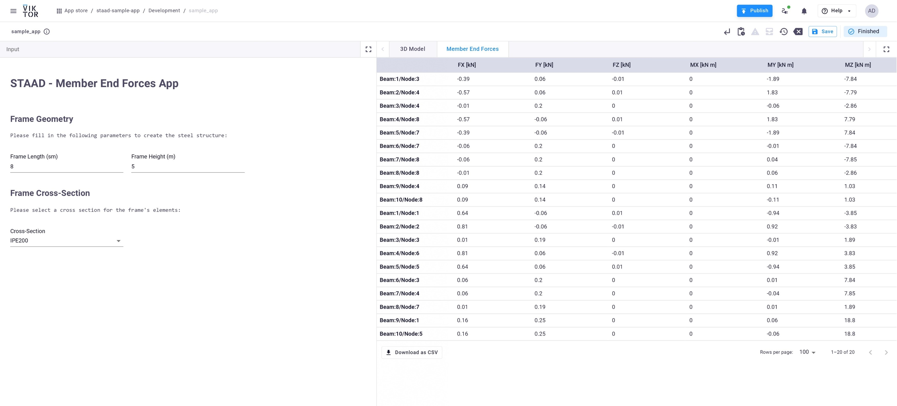

# STAAD Pro Sample App

The following repository demonstrates how to connect a VIKTOR web app with STAAD Pro using the VIKTOR worker. As an example, the demo app creates a steel structure in STAAD Pro, generates a load case with self-weight, calculates the internal loads at the ends of the frame elements, and retrieves the results.

The repository uses the OpenSTAAD Application API, managed by comtypes, to launch, close, and create the model, as well as assign the relevant structural inputs. It also utilizes the Python library [openstaad](https://github.com/OpenStaad/OpenStaadPython) for retrieving the results.




### Requirements

The following are the requirements:

1. **STAAD Pro Executable**: STAAD Pro must be installed on your machine or server.
    - The machine hosting the STAAD Pro executable and valid license requires a Python environment with the following dependencies installed:

    ```bash
    comtypes
    pywin32
    openstaad
    ```

2. **Development of the Client Side (VIKTOR Web App)**:
    - Refer to the `requirements.txt` file and ensure the dependencies listed there are installed.

## Worker Configuration

The server or local machine where STAAD Pro is hosted requires a VIKTOR worker setup. To install the worker and configure it, follow the tutorial on [VIKTOR's Generic Worker Configuration](https://docs.viktor.ai/docs/create-apps/software-integrations/generic/).

Ensure the configuration file resembles the following:

```yml
executables:
  run_staad:
    path: 'C:\Users\<YourUsername>\AppData\Local\Programs\Python\PythonXX\'
    arguments:
      - 'run_staad_model.py'
    workingDirectoryPath: 'C:\StaadServer'
maxParallelProcesses: 1
```
